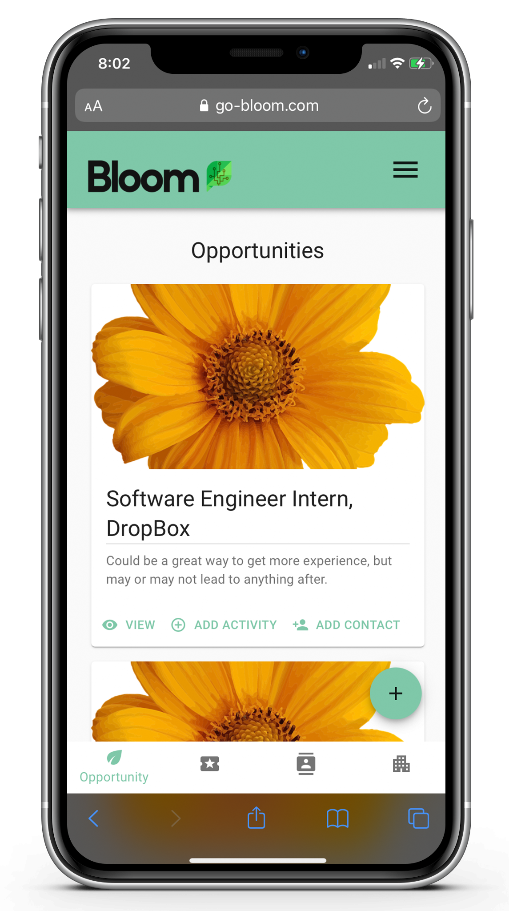
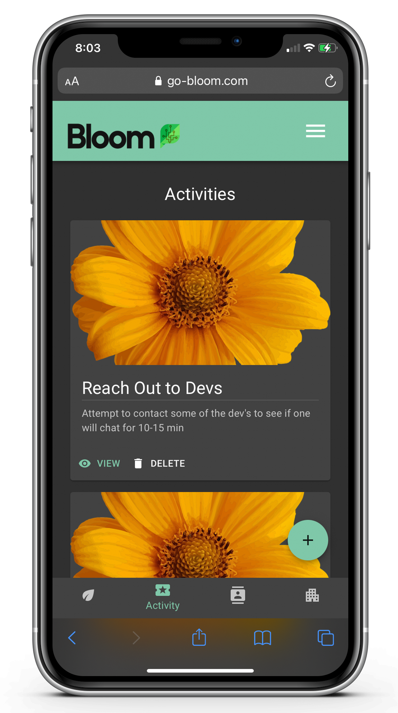

Grow Your OpportunitiesTM

## Background

### [Watch the Bloom Intro Video](https://www.youtube.com/watch?v=w4OMpRpCu7M)

At Bloom, we believe every job seeker deserves an opportunity to find meaningful work. That starts with helping you turn complexity into simplicity. When you simplify your search, you can grasp your options, prioritize what you want, and take action to land your next role.

Bloom helps you easily track job opportunities. Maintain a lightweight CRM of contacts and companies so you don’t get overwhelmed. And perhaps most exciting of all, Bloom helps you take action. Map your activities to job opportunities so you know exactly where you stand in the process, and what you need to do next.

## Getting Started

1. [Sign Up](https://go-bloom.com)
2. Create an opportunity
3. Add activities, contacts, and companies

## Screenshots
<table>

<tr>
<td>

</td>
<td>

</td>
</tr>

<tr>
<td>

</td>
<td>

</td>
</tr>

<tr>
<td>

</td>
<td>

</td>
</tr>

<tr>
<td>

</td>
<td>

</td>
</tr>

<tr>
<td>

</td>
<td>

</td>
</tr>

</table>

## Features

- Mobile responsive
- Light + dark mode
- Token-based auth
- Standalone API w/ Django backend
- React.js frontend

## Technologies Used

- React.js
- Django
- Python
- PostgreSQL
- JavaScript
- HTML
- CSS
- Material UI
- Heroku
- Lottie

## Next Steps

- Improve error and success handling/messages
- Add search, filter, and sort functionality
- Notifications + reminders

For a complete list of icebox items in the Bloom backlog, [visit our Trello board](https://trello.com/b/bTZJXCsD).

Checkout the [Bloom backend](https://github.com/jonathanherman1/bloom_backend) built with Django.